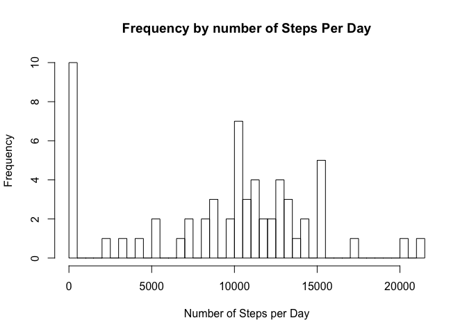
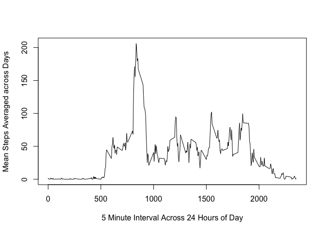
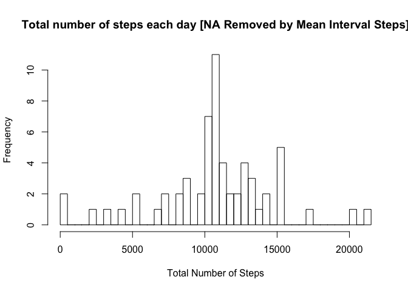
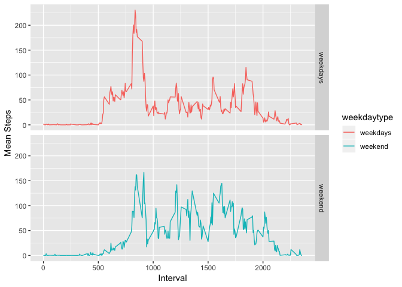

```r
if(!"knitr" %in% installed.packages()){
        install.packages("knitr")
} 
library(knitr)
if(!"dplyr" %in% installed.packages()){
        install.packages("dplyr")
} 
library(dplyr)
```

```
## Warning: package 'dplyr' was built under R version 3.4.4
```

```
## 
## Attaching package: 'dplyr'
```

```
## The following objects are masked from 'package:stats':
## 
##     filter, lag
```

```
## The following objects are masked from 'package:base':
## 
##     intersect, setdiff, setequal, union
```

```r
if(!"xtable" %in% installed.packages()){
        install.packages("xtable")
} 
library(xtable)
```

```
## Warning: package 'xtable' was built under R version 3.4.4
```

```r
if(!"ggplot2" %in% installed.packages()){
        install.packages("ggplot2")
} 
library(ggplot2)
```

```
## Warning: package 'ggplot2' was built under R version 3.4.4
```

```r
knitr::opts_chunk$set(echo=TRUE,results="asis")
```

## Loading and preprocessing the data
1. Creating Data Directory , Downloading file and Unzipping file

```r
datadir<-"./RepData_PeerAssessment1-master"
if (!dir.exists(datadir)){
        dir.create(datadir)
}
zipfile<-"./RepData_PeerAssessment1-master/activity.zip"
zipurl<-"https://d396qusza40orc.cloudfront.net/repdata%2Fdata%2Factivity.zip"
if (!file.exists(zipfile)){
        download.file(zipurl,destfile = zipfile)
        unzip(zipfile,exdir = datadir)
}
```
2. Reading Content of the file (Laoding File)

```r
activityfile<-"./RepData_PeerAssessment1-master/activity.csv"
activity<-read.csv(activityfile)
```
3. Preprocessing data 

```r
activity$date<-as.Date(as.character(activity$date))
```

## What is mean total number of steps taken per day?
1.Calculate the **total number of steps taken per day**

```r
stepsPerDay<-summarise(group_by(activity,date),totalStepsPerDay=sum(steps,na.rm = TRUE))
stepday<-xtable(stepsPerDay)
stepday$date<-as.character(stepday$date)
colnames(stepday)<-c("Date","Total Steps")
print(head(stepday),type="html") #Printing only first 6 Lines of steps each day ,for full data remove head function
```

<!-- html table generated in R 3.4.3 by xtable 1.8-3 package -->
<!-- Sun Sep 30 21:51:52 2018 -->
<table border=1>
<tr> <th>  </th> <th> Date </th> <th> Total Steps </th>  </tr>
  <tr> <td align="right"> 1 </td> <td align="right"> 2012-10-01 </td> <td align="right">   0 </td> </tr>
  <tr> <td align="right"> 2 </td> <td align="right"> 2012-10-02 </td> <td align="right"> 126 </td> </tr>
  <tr> <td align="right"> 3 </td> <td align="right"> 2012-10-03 </td> <td align="right"> 11352 </td> </tr>
  <tr> <td align="right"> 4 </td> <td align="right"> 2012-10-04 </td> <td align="right"> 12116 </td> </tr>
  <tr> <td align="right"> 5 </td> <td align="right"> 2012-10-05 </td> <td align="right"> 13294 </td> </tr>
  <tr> <td align="right"> 6 </td> <td align="right"> 2012-10-06 </td> <td align="right"> 15420 </td> </tr>
   </table>
2. Make a **histogram** of the total number of steps taken each day

```r
hist(stepsPerDay$totalStepsPerDay,breaks = 60,xlab="Number of Steps per Day",main = "Frequency by number of Steps Per Day")
```

<!-- -->

```r
#Break at 60 (data for 61 Days)
```
3. Calculate and report the **mean and median** of the total number of steps taken per day

```r
MeanSteps<-mean(stepsPerDay$totalStepsPerDay)
MedianSteps<-median(stepsPerDay$totalStepsPerDay)
```
Mean of Steps Taken per day **9354.2295082** and Median of Steps Taken per day **10395**  

## What is the average daily activity pattern?

1.Make a **time series plot** (i.e. \color{red}{\verb|type = "l"|}type="l") of the **5-minute interval (x-axis)** and the **average number of steps taken, averaged across all days (y-axis)**

```r
meanIntervalSteps<-summarise(group_by(activity,interval),Mean=mean(steps,na.rm = TRUE))
plot(meanIntervalSteps$interval,meanIntervalSteps$Mean,type = "l",xlab = "5 Minute Interval Across 24 Hours of Day",ylab = "Mean Steps Averaged across Days")
```

<!-- -->
  
2.**Which 5-minute interval**, on average across all the days in the dataset, contains the **maximum number of steps?**

```r
maxStepOfDay<-which(meanIntervalSteps$Mean==max(meanIntervalSteps$Mean))
maxInterval<-meanIntervalSteps[maxStepOfDay,1]
```
Interval **835** have maximum number of steps on average across all the days in the dataset  

## Imputing missing values   
1.**Calculate and report the total number of missing values** in the dataset (i.e. the total number of rows with \color{red}{\verb|NA|}NAs)  

```r
NA_count<-sum(is.na(activity))
```
Total Missing **NA's** are **2304**

2.Devise a strategy for filling in all of the missing values in the dataset. The strategy does not need to be sophisticated. For example, you could use the mean/median for that day, or the mean for that 5-minute interval, etc.  


```r
#Using mean of every 5 minute interval to Impute data 
rows<-is.na(activity$steps)
subsetactivity<-activity[rows,]
subInterval<-subsetactivity$interval
meanInterval<-meanIntervalSteps$interval
```
3.Create a new dataset that is equal to the original dataset but with the missing data filled in.  


```r
for (subInterval in meanInterval)
        {
        activity[rows,"steps"]<-(meanIntervalSteps$Mean)
        }       
#Displaying find few rows of Imputed dataset
xt1<-xtable(activity)
xt1$date<-as.character(xt1$date)
print(head(xt1),type="html")
```

<!-- html table generated in R 3.4.3 by xtable 1.8-3 package -->
<!-- Sun Sep 30 21:51:53 2018 -->
<table border=1>
<tr> <th>  </th> <th> steps </th> <th> date </th> <th> interval </th>  </tr>
  <tr> <td align="right"> 1 </td> <td align="right"> 1.72 </td> <td align="right"> 2012-10-01 </td> <td align="right">   0 </td> </tr>
  <tr> <td align="right"> 2 </td> <td align="right"> 0.34 </td> <td align="right"> 2012-10-01 </td> <td align="right">   5 </td> </tr>
  <tr> <td align="right"> 3 </td> <td align="right"> 0.13 </td> <td align="right"> 2012-10-01 </td> <td align="right">  10 </td> </tr>
  <tr> <td align="right"> 4 </td> <td align="right"> 0.15 </td> <td align="right"> 2012-10-01 </td> <td align="right">  15 </td> </tr>
  <tr> <td align="right"> 5 </td> <td align="right"> 0.08 </td> <td align="right"> 2012-10-01 </td> <td align="right">  20 </td> </tr>
  <tr> <td align="right"> 6 </td> <td align="right"> 2.09 </td> <td align="right"> 2012-10-01 </td> <td align="right">  25 </td> </tr>
   </table>
  
4.Make a histogram of the total number of steps taken each day and calculate and report the mean and median total number of steps taken per day. Do these values differ from the estimates from the first part of the assignment? What is the impact of imputing missing data on the estimates of the total daily number of steps?  

```r
TotalStepsPerDay<-summarise(group_by(activity,date),Total=sum(steps))
hist(TotalStepsPerDay$Total,breaks = 60,xlab = "Total Number of Steps",main = "Total number of steps each day [NA Removed by Mean Interval Steps]")
```

<!-- -->
  
Compute Mean and Median after Imputed Data  


```r
Mean<-format(round(mean(TotalStepsPerDay$Total),digits = 2),nsmall=2)
Median<-format(round(median(TotalStepsPerDay$Total),digits = 2),nsmall=2)
```
Values of **Mean** and **Median** after Imputed data is **10766.19** and **10766.19** respectively.We can clearly see here after Imputing data the Mean and Median merges as compared to previous values which had NA's where there was significant difference between the two values.   


## Are there differences in activity patterns between weekdays and weekends?
1.Create a new factor variable in the dataset with two levels - “weekdays” and “weekend” indicating whether a given date is a weekday or weekend day.  

```r
activity$day<-tolower(weekdays(activity$date))
activity$weekdaytype<-ifelse(activity$day=="sunday"|activity$day=="saturday","weekend","weekdays") 
activity$weekdaytype<-factor(activity$weekdaytype,levels=c("weekdays","weekend"))
#This Created weekdaytype variable in dataset with two level factor variable
```
  
2.Make a panel plot containing a time series plot (i.e. type = "l") of the 5- minute interval (x-axis) and the average number of steps taken, averaged across all weekday days or weekend days (y-axis).  

```r
StepsIntDayType<-summarise(group_by(activity,interval,weekdaytype),TotalMean=mean(steps))
ggplot(StepsIntDayType,aes(interval,TotalMean,col=weekdaytype))+
        geom_line()+
        facet_grid(weekdaytype~.)+
        xlab("Interval")+
        ylab("Mean Steps")
```

<!-- -->
